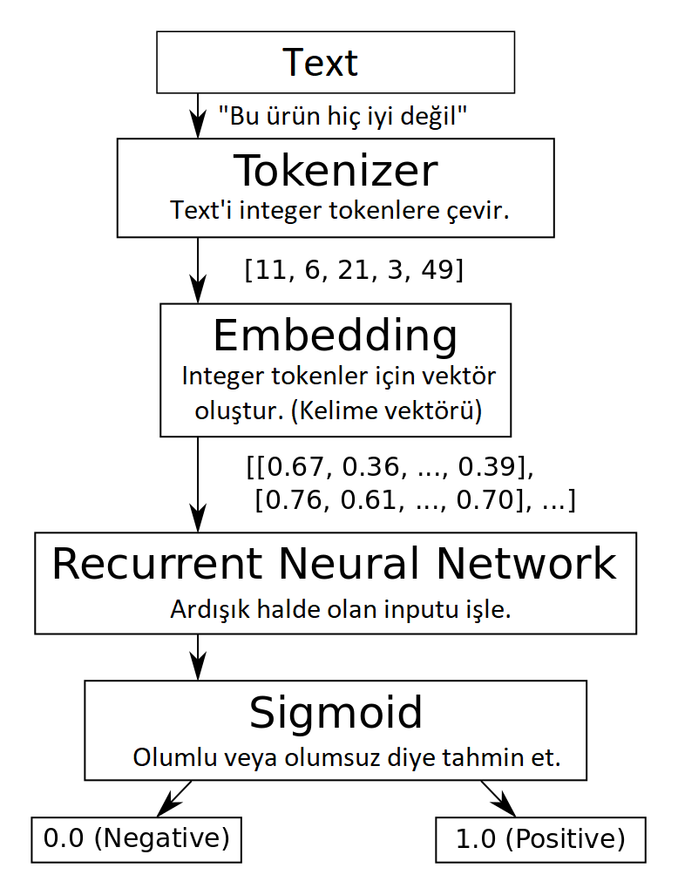

# SentimentAnalysis

Duygu Analizi yani Sentiment Analysis projemde veri seti olarak hepsiburada sitesinin yorumlarını kullandım.

Bu projemi gerçekleştirirken RNN(Recurrent Neural Network) yani Yinelenen Sinir Ağı kullandım.(GRU)

Veri Setinde toplamda 243.938 veri bulunmakta.

Aşağıda görmüş olduğunuz tablo projemin çalışma mantığını göstermektedir.

Projemin bu kısmında model eğitip testini gerçekleştirdi fakat geliştirip bir uygulamaya embed etmeye çalışacağım.

